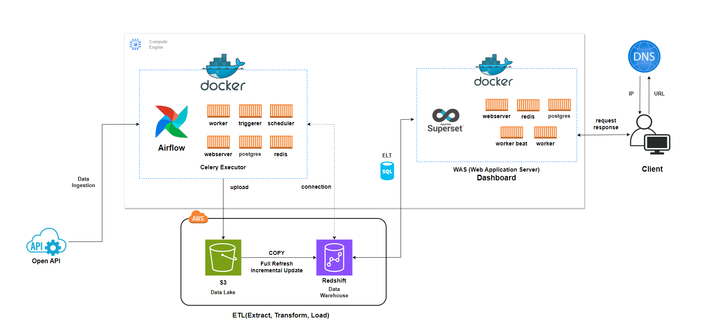

# netproj
Dashboard using Data Warehouse

### Software Architecture

- Python, Pandas, Docker
- Server : Google Compute Engine (ubuntu 22.04.3 LTS, CPU4, RAM16)
- Airflow : v2.6.3
- Superset : v3.0.2
- Data Lake : AWS S3
- Data Warehouse : AWS Redshift
- Data Source :  
[공공데이터포털 : 한국서부발전(주)_신재생에너지 발전량](https://www.data.go.kr/tcs/dss/selectApiDataDetailView.do?publicDataPk=15121592#/API%20%EB%AA%A9%EB%A1%9D/getReGeneration)
